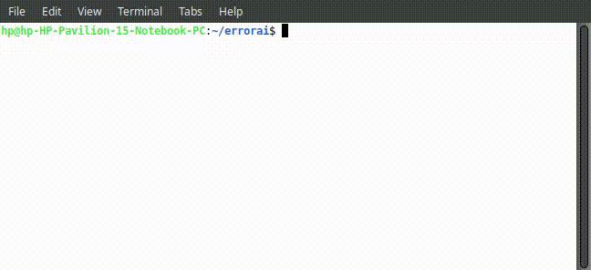

# ErrorAI: An Error Identification Tool for Beginners

ErrorAI is a tool designed to help beginners identify and understand errors returned by a program during compilation. It uses Google Gemini AI to process the error messages and provides insights into the cause of the errors. This tool is ideal for anyone learning programming, particularly in languages like Go, who may struggle with interpreting error messages.



## Features
- Runs a command (e.g., `go run build.go`) and captures the error output (stderr).
- Sends the error messages to Google Gemini AI for analysis.
- Helps beginners understand and resolve common compilation issues.

## Prerequisites
- **Go 1.18+**: Ensure you have Go installed on your system.
- **Gemini AI API Key**: You need a valid API key from Google Gemini to use the AI features.
- **Internet connection**: Required for the Gemini API to function.

## Configuration

1. **Set up your environment variables**:
   - **GEMINI_KEY**: You must have a valid API key for Google Gemini. Set it as an environment variable:
   
     ```bash
     export GEMINI_KEY="your_gemini_api_key"
     ```

   - **GEMINI_MODEL** (optional): You can specify the Gemini model to use. If not set, the default model `"gemini-1.5-flash"` will be used. Set the model like this:
   
     ```bash
     export GEMINI_MODEL="your_preferred_model"
     ```

## Installation

1. Clone the repository to your local machine:

   ```bash
   git clone https://github.com/yourusername/errorai.git
   cd errorai
   ```

2. Install any dependencies (e.g., Google Gemini Go SDK):

   ```bash
   go mod tidy
   ```

3. Build the program:

   ```bash
   go build -o errorai
   ```

## Usage

To run ErrorAI and analyze error messages, use the following command structure:

```bash
errorai <command> <arguments>
```

For example, if you want to run a Go program (`go run build.go`) and analyze any compilation errors, you would use:

```bash
errorai go run build.go
```

### How it works:

- The program will execute the specified command (e.g., `go run build.go`).
- It captures any error output (`stderr`) produced during the execution.
- The error messages are sent to Gemini AI for analysis, and insights are returned to the user.

### Example:

```bash
errorai go run build.go
```

If there are errors during the `go run build.go` execution, ErrorAI will:
1. Capture the error messages.
2. Send them to Gemini AI for analysis.
3. Print the results, providing insights or explanations about the errors.

## Troubleshooting

1. **Missing GEMINI_KEY**: If you haven't set the `GEMINI_KEY` environment variable, the program will fail with an error. Make sure to set it with your valid API key.

2. **No command provided**: If you run the program without any arguments, it will print an error: `No command provided to execute`. Ensure you specify the command you want to run.

3. **Command execution failures**: If the command you specify fails, the error messages will be captured and processed. If Gemini AI is unable to analyze the error, a fallback log message will be printed.


---

Please file an issue if you run into a problem